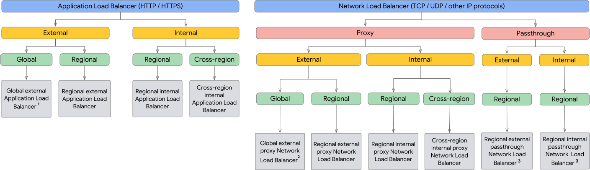
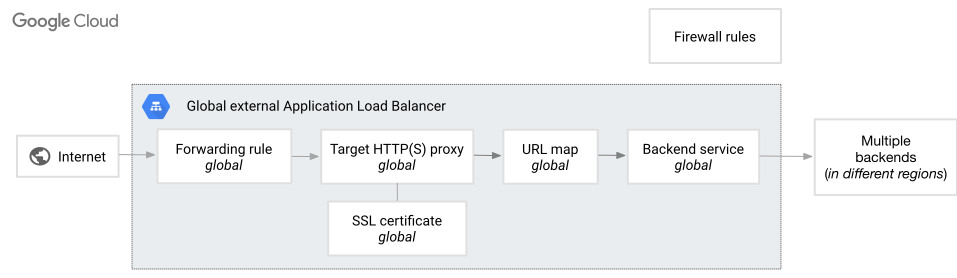

# Best practises

## GFE

* The GFE is an HTTP/TCP reverse proxy which is used to serve requests to many Google properties including: Search, Ads, G Suite (Gmail, Chat, Meet, Docs, Drive, etc.), Cloud External HTTP(S) Load Balancing, Proxy/SSL Load Balancing, and many Cloud APIs
* 1st level sends request to backend, or through 2nd level in some cases
* GFE additionally applies protection against denial of service attacks.

## Cloud Armour

* WAF solution at GCP, ML based L7 protection against DDoS
* Mitigate OWASP Top 10 risks and help protect workloads
* Bot management to stop fraud at the edge through native integration with reCAPTCHA Enterprise
* security policies
  * to protect applications
  * define prioritized rules with configurable match conditions and actions
  * provide edge security and act on client traffic to **Google Front Ends (GFEs)**
  * works with Serverless NEG as well
  `preview mode` helps at early stages
* Threat Intelligence
* Named IP address lists
* Adaptive Protection
* works with below LB
  * Global external Application Load Balancer
  * Classic Application Load Balancer
  * External proxy Network Load Balancer
  * External passthrough Network Load Balancer

## Load Balancers

{ loading=lazy }

* Tips:
  * Only `external` can be global
  * `internal` LB can be cross-regional or regional
  * `regional` LB - IPV4 (not IPV6) termination, regulatory need to keep data in single region
  * `proxy LB` - terminate conn at LB and create new conn from LB to backend
    * terminate conn using either GFE or Envoy proxy
  * `pass through LB` - Direct Server Return
    * conn terminates at backend and response directly goes to client (skips LB) 
    * always regional (cant be global)
  * Proxy can use Google cert, but pass-through need self/own cert
  * `premium tier` - all internal and global external LB
  * `standard tier` - IP of LB in standard tier of VPC
    * regional external
    * regional classic
    * external passthrough LB
    * not possible for global LB
  * `global ext Appln` LB is GFE based, but `regional ext Appln` LB is Envoy based
  * `http proxy uses URL Map` to route using attributes - req path, cookies, headers
  * Proxy-only subnets are only required for regional external Application Load Balancers
    * CIDR range to run VM with Envoy proxies
  * IPV6
    * Global external HTTP(S) and external proxy Network Load Balancers terminate IPv6 connections at the load balancer and forward traffic to backends over IPv4
    * IPv6 support in regions: Not all regions support IPv6 traffic for all load balancer types. Check regional availability for specific needs
    * Internal load balancers do not currently support IPv6 traffic
    * Other load balancer types, like SSL Proxy and TCP Proxy load balancers, do not have native IPv6 support

* HTTP(S) load balancing
  * Application LB, for HTTP and HTTPS
  * across mult backends, across mult regions
  * single global IP
  * scalable, fault tolerant, no pre-warming needed
  * can do content based LB as its at application level
  * SSL termination at LB
  * to use gRPC, protocol should be HTTP/2

* TCP/SSL/UDP load balancing
  * Network LB at L4
  * can LB at single region or multiple regions
  * scalable, no pre-warming
  * it can be proxy or passthrough

* SSL policies:
  * set min TLS version
  * MODERN or RESTRICTED profile selection
  * disable some features

* Application Load Balancer
  * forwarding rule
    * single IP to be used in DNS
    * can map to a single port
    * if mult ports needed, mult Forw Rules need to be created - but all these can use single VIP
  * target proxy
    * this terminates the connection from client
  * URL map
    * matching pattern for URL mapping
    * this also supports header based traffic steering, weight based traffic splitting and request mirroring
  * SSL Certs
    * it needs private keys and SSL certs
    * certs can be self or Google managed
    * LB can use Mutual TLS (mTLS) - where LB asks clients to send cert for auth
  * backed service
    * MIG or NEG or buckets
    * has to be in the same project but can use diff VPC (n case of regional LB, it has to be same VPC)
    * diff VPC doesn't need to have Peering, GFE manages that
  * Health checks
  * Firewall rules
    * for external LB - GFE to backend is needed
    * for regional LB - proxy-only subnet to backend if needed

* External Application Load Balancers offer the following types of session affinity:

  * NONE. Session affinity is not set for the load balancer.
  * Client IP affinity
  * Generated cookie affinity
  * Header field affinity (not for Classic)
  * HTTP Cookie affinity (not for Classic)

* Proxy Network Load Balancer
  * reverse proxy and L4
  * only uses TCP - with or without SSL
  * allow any valid port from 1-65535
  * port can be mapped to a diff value at abckend
  * Cloud Armor is available
  
* pass through load balancer
  * either uses Maglev or Andromeda 
  * works for  for TCP, UDP, ESP, GRE, ICMP, and ICMPv6 traffic

# Protection levels

## Data protection

### Governance

### Configuring format-preserving substitution

* `Pseudonymization` is a technique that replaces sensitive data with cryptographically generated tokens
  * also referred to as tokenization or surrogate replacement
* symmetric keys allow 2 ways changes and hence the name
* Types
  * Deterministic encryption using AES-SIV - produces hash and hence orig char set is not preserved, can re-identify
  * Format preserving encryption - both the character set and the length of the input value are preserved in the output value, can re-identify
    * char-set can be nemuric, hexa, alpha-numeric 
  * Cryptographic hashing - uses HMAC-SHA-256, length is same, but can't re-identify

### Restricting access to BigQuery, Cloud Storage, and Cloud SQL datastores

## Data Masking

<https://cloud.google.com/apigee/docs/api-platform/security/data-masking>

## Infra Security

* DDoS
* Firewalls
* IDS/IPS
* WAF
* Container Security

### Automating virtual machine image creation, hardening, maintenance, and patch management

* For added security, you can also use the Trusted image feature to define an organization policy (ompute.trustedImageProjects) that restricts images in specific public image projects from being used
* startup scripts - to load what you need, but in idempotent way
* The process of creating a custom image is called **baking**.
* Automated baking using Packer
* Enforcing lifecycle policies -
  * --delete-in or --delete-on
  * --obsolete-in or --obsolete-on
* `compute.imageUser` for using images from shared project

### Automating container image creation, verification, hardening, maintenance, and patch management

* NA

### Automating policy as code and drift detection

* `Chekov` from HSBC side
* Codify infrastructure and policies
* automate routine compliance checks
* Automated enforcement - Prevent non-compliance by asserting infrastructure and policies as code for easy onboarding on Google Cloud
* Detect non-compliance via Security Command Center, notifying stakeholders when offending infrastructure is identified.
* Modernize compliance by automating routine checks to reduce your audit fatigue

* Use `IaC` (like Terraform) to detect drift

* Drift -
  * In the context of infrastructure and application management, drift refers to the system state in which the actual configuration and state of the system deviate from the intended or expected configuration and state
  * automated by tools, scripts or services that analyze and compare configurations, resource states or event logs

## Scanning, Logging and Monitoring

* Vuln Scanning
* SIEM

